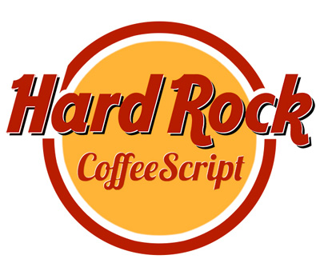

## Hard Rock CoffeeScript

CoffeScript is a little language that compiles to JavaScript created by Jeremy Ashkenas. This is an evolution of JavaScript that hides its bad parts and exposes the good parts. It's syntax is inspired by Ruby and Python and brings many features from these two languages.

Why is CoffeeScript better than writing pure JavaScript? First of all CoffeeScript allows you to actually write less and do more (yep, exactly like jQuery:smile:). The amount of code that you'll need to write reduces sugnificantly — you're geeting rid of curly brackets, semicolons and you are getting lots of syntactic sugar. Moreover it adds usefull features like classes and inheritance which have not yet arrived natively to JavaScript.

But still, *coffee* code compiles to *JavaScript* so in order to write programs in CoffeeScript you need to know JavaScript. It is impossible to write well sctutured and good working scripts without understanding basics of JavaScript like closures or prototypical model. Knowledge of design patterns in JavaScript will be also usefull as CoffeeScript is using some patterns like *Module pattern*, *Prototype*.

### JavaScript Lint

JavaScript Lint is a JavaScript code quality tool, and running your programs through it is a great way of improving code quality and best practices. The project was based on a similar tool called JSLint. Check out JSLint's site for a great list of issues that it checks for, including global variables, missing semicolons and weak equality comparisons.

The good news is that CoffeeScript already 'lints' all of its output, so CoffeeScript generated JavaScript is already JavaScript Lint compatible
